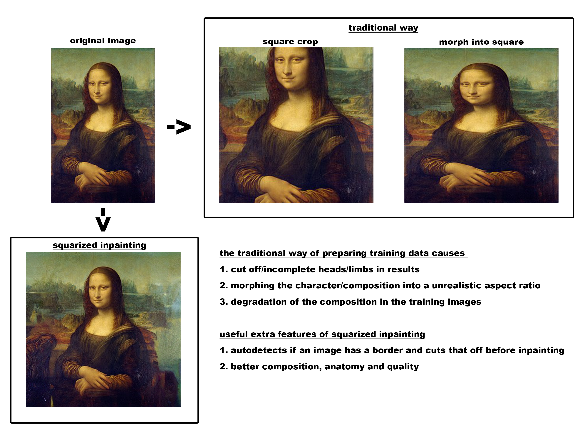
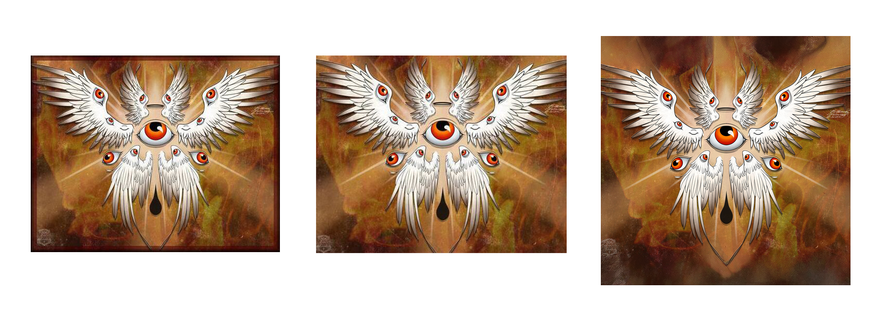

# squarize-images

#

for voc activate voc_sd environment

pip install natsort==8.1.0  on top of the environment

place src folder in stable diffusion folder

Download the pre-trained weights

```
wget -O src/latent-diffusion/models/ldm/inpainting_big/last.ckpt https://heibox.uni-heidelberg.de/f/4d9ac7ea40c64582b7c9/?dl=1
```
to run the script

```
python src\\latent-diffusion\\squarizeimages.py --input "C:\Users\Gebruiker\Documents\Visions of Chaos\Movies\00000000/" --steps "50" --projectname "square1" --edgeremoval --edgedetection "40%" --extra_crop --outdir "whatever/dir/is/possible"
```
**--input** the input folder

**--steps** the amount of steps the inpainting does

**--edgeremoval** activates --edgedetection

**--edgedetection** the percentage of how much borderdetection is going on

**--extra_crop** adds an extra 10px crop on each side 

**--outdir** the output folder




this is an example of a combination of --edgeremoval --edgedetection "40%" --extra_crop to remove borders


